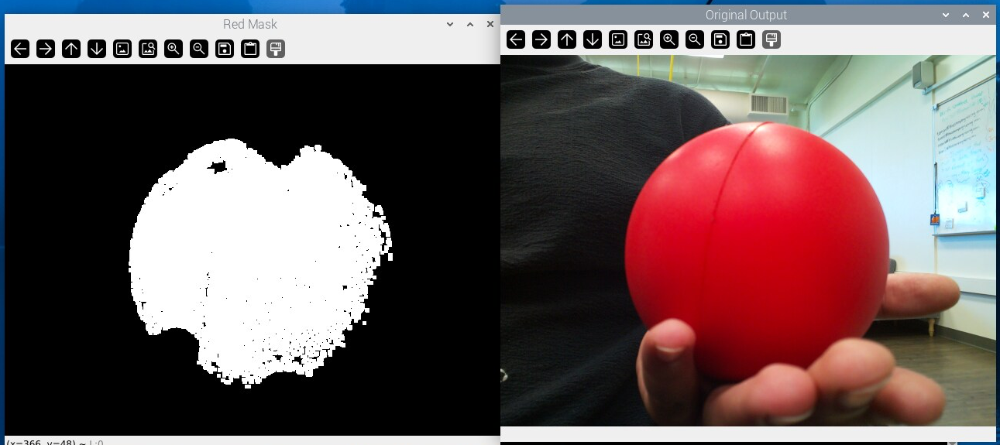
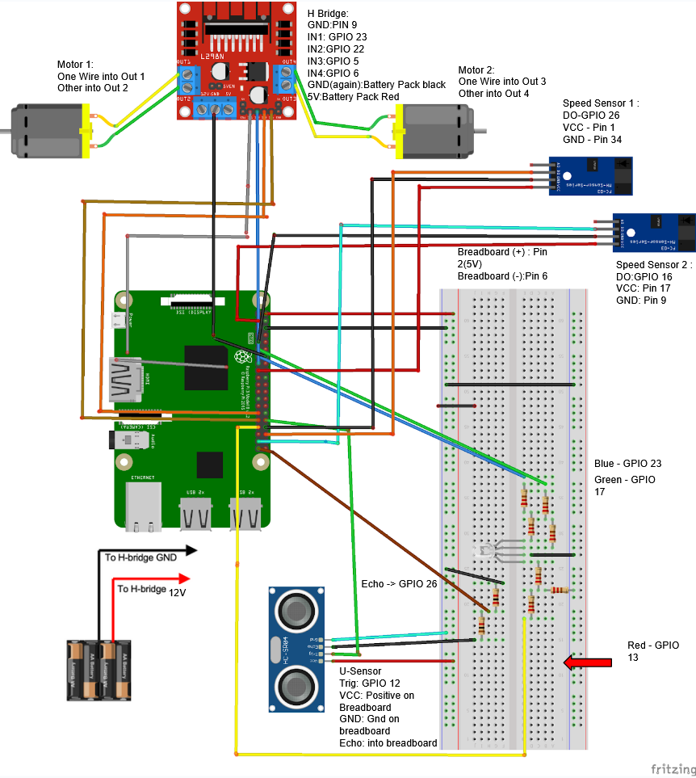
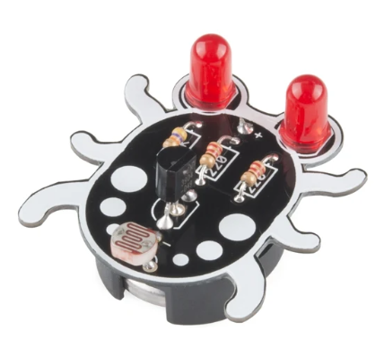
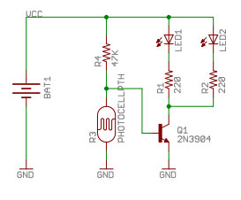

# Ball Tracking Robot
I am building a robot that can follow a red ball. Using a Raspberry Pi, Pi Camera, motors, an ultrasonic sensor, and code, the robot scans for red objects and goes toward the object. If the robot cannot find anything red, then the robot will enter a scanning mode, spinning in a circle until it finds a red object. If the robot detects something too close to it, it will back up and continue searching for the ball. Using two speed measuring modules, I will also have the robot print a map of its movements.

| **Engineer** | **School** | **Area of Interest** | **Grade** |
|:--:|:--:|:--:|:--:|
| Ahaan P | Fremont High School | Mechanical Engineering | Incoming Junior


# Third Milestone


<iframe width="560" height="315" src="https://www.youtube.com/embed/FoBqtvqutC4?si=Kx8xMMg17BJIcstW" title="YouTube video player" frameborder="0" allow="accelerometer; autoplay; clipboard-write; encrypted-media; gyroscope; picture-in-picture; web-share" referrerpolicy="strict-origin-when-cross-origin" allowfullscreen></iframe>

## Summary
For my third milestone, I needed to mount all the components I showed in the previous milestone onto the drive base. I also made code that combined the functionality of each component to track the ball.
For the mounting, I first mounted my Pi Camera and ultrasonic sensor to the front of the drive. I fed the wires of the ultrasonic sensor through a hole and taped them to the drive base using double-sided tape. Then I put the ultrasonic sensor into its holder, which was screwed into the base. Then I stuck my Pi Camera right above the ultrasonic sensor, to make sure that the readings from the ultrasonic sensor were as close to the camera as possible. Then I mounted the Raspberry Pi behind the camera, to make sure that the camera's cable did not need to twist and bend. Then I mounted the power bank on top of the battery pack that powered the motors. The battery pack ensures that the Raspberry Pi has power and will let the robot move freely without having to be hooked up to a wall outlet.

After mounting everything, I ran the same test code from the previous milestone to make sure all the components were still working. Then I got to writing code that would combine all the components. First, I had to detect the ball. I did this by using the color mask to find the largest red object, which would represent a red object. Then I had to detect the area of the red object. I started this by looking at the past student's work and learning that to detect the area, I had to code a method that measures the pixels of the largest red object when detected and calculates its area. The robot view panel also shows the square outline of the object. Other than that, I had to make the robot move towards the ball when it was detected. By assigning minimum and maximum area values for detection, the robot would only spot the ball if it was at least 5cm away from the distance sensor, and a maximum distance of about 20cm.  After that, I had to measure the distance between the ball and the robot. I did this by periodically sending pulses from the ultrasonic sensor. To detect the distance of the ball, the camera also had to see the ball, to make sure only the ball's distance would be detected. Then, I made sure that the robot moved incrementally until the distance between the ball and the robot was 5 cm. After setting everything up, all that was left was the calibration, to make the robot as accurate as I could make it.

## Challenges
One challenge I faced was that if the ball was not in the frame, the robot would just start moving randomly. To combat this, I created a "searching mode" where, if there was no ball detected, then the robot would move in a circle slowly until the ball was spotted. To better see what the robot was doing, I made it so that the robot displayed its current action on the robot view screen. Another challenge I faced was that the Pi Camera was not filtering color correctly. I fixed this by changing the RGB values of the filter until it seemed good. Another challenge I faced was mounting everything without wires getting caught by the wheels. After running out of space on the top, I had to move my H-bridge to the underside of the robot and swap the wires for shorter ones so that they would not get caught by the motor.

## Next Steps
For my next steps, I want to have a map of the robots movements to be drawn as it moves. I plan on doing this using turtle, a drawing library in python, and using an IMU(inertial measurement unit) which will be able to give the real direction of the robot.

## Ball Tracking Code
<pre style="background:#fdfdfd; border:none; height:40pc"><code class = "language-python">
#PYTHON
import cv2
from picamera2 import Picamera2
import time
import numpy as np
import RPi.GPIO as GPIO

# --- Configuration Constants ---
# Sensor Proximity (centimeters)
SENSOR_PROXIMITY = 2
REROUTING_PROXIMITY = 17.5
DISTANCE_THRESHOLD = 2  # cm: distance at which the robot should stop

# Robot Behavior Constants
CENTER_TOLERANCE = 80  # Pixels: Defines a 40-pixel dead zone for straight movement
TARGET_CONTOUR_AREA_MIN = 5000  # Minimum pixel area for the ball
TARGET_CONTOUR_AREA_MAX = 110000  # Maximum pixel area for the ball
PARKED_AREA_THRESHOLD = 10000  # Area threshold for the 'parked' state

# Movement Delays (in seconds)
# Adjust these values to control how long each action is performed.
# Shorter delays: more responsive, potentially more erratic.
# Longer delays: smoother, less responsive.
FORWARD_DELAY = 0.15
TURN_DELAY = 0.1
REVERSE_DELAY = 0.2
REROUTE_TURN_DELAY = 0.25
PAUSE_AFTER_MOVEMENT = 0.01 # Small pause after stopping motors for stability

# GPIO Pin Assignments
# Ultrasonic Sensor Pins
ULTRASONIC_PINS = {
    "left": {"trigger": 19, "echo": 26},
    "front": {"trigger": 16, "echo": 20},
    "right": {"trigger": 11, "echo": 12},
}

# Motor Pins
MOTOR_PINS = {
    "left_b": 6,  # LEFT Motor Backward
    "left_e": 5,  # LEFT Motor Enable (or Forward based on H-bridge setup)
    "right_b": 22, # RIGHT Motor Backward
    "right_e": 23, # RIGHT Motor Enable (or Forward based on H-bridge setup)
}

# LED Pins
LED_SEARCH = 18
LED_PARKED = 5

# --- GPIO Setup ---
def setup_gpio():
    """Sets up all GPIO pins."""
    GPIO.cleanup()
    GPIO.setwarnings(False)
    GPIO.setmode(GPIO.BCM)

    # Setup ultrasonic sensor pins
    for sensor in ULTRASONIC_PINS.values():
        GPIO.setup(sensor["trigger"], GPIO.OUT)
        GPIO.setup(sensor["echo"], GPIO.IN)
        GPIO.output(sensor["trigger"], False) # Ensure trigger is low initially

    # Setup motor pins
    for pin in MOTOR_PINS.values():
        GPIO.setup(pin, GPIO.OUT)

    # Setup LED pins
    GPIO.setup(LED_SEARCH, GPIO.OUT)
    GPIO.setup(LED_PARKED, GPIO.OUT)

    time.sleep(0.01) # Allow modules to settle

# --- Motor Control Functions ---
def set_motor_state(motor_b_pin, motor_e_pin, state_b, state_e):
    """Sets the state for a pair of motor pins."""
    GPIO.output(motor_b_pin, state_b)
    GPIO.output(motor_e_pin, state_e)

def stop_motors():
    """Stops both motors."""
    set_motor_state(MOTOR_PINS["left_b"], MOTOR_PINS["left_e"], GPIO.LOW, GPIO.LOW)
    set_motor_state(MOTOR_PINS["right_b"], MOTOR_PINS["right_e"], GPIO.LOW, GPIO.LOW)

def execute_movement(action_name, left_b_state, left_e_state, right_b_state, right_e_state, delay):
    """Executes a motor movement with a given delay and stops."""
    print(f"Moving: {action_name}")
    set_motor_state(MOTOR_PINS["left_b"], MOTOR_PINS["left_e"], left_b_state, left_e_state)
    set_motor_state(MOTOR_PINS["right_b"], MOTOR_PINS["right_e"], right_b_state, right_e_state)
    time.sleep(delay)
    stop_motors()
    time.sleep(PAUSE_AFTER_MOVEMENT)

def move_forward():
    execute_movement("Forward", GPIO.HIGH, GPIO.LOW, GPIO.HIGH, GPIO.LOW, FORWARD_DELAY)

def move_reverse():
    execute_movement("Backward", GPIO.LOW, GPIO.HIGH, GPIO.LOW, GPIO.HIGH, REVERSE_DELAY)

def turn_left():
    execute_movement("Turning Left", GPIO.LOW, GPIO.LOW, GPIO.HIGH, GPIO.LOW, TURN_DELAY)

def turn_right():
    execute_movement("Turning Right", GPIO.HIGH, GPIO.LOW, GPIO.LOW, GPIO.LOW, TURN_DELAY)

def sharp_left():
    execute_movement("Sharp Left", GPIO.LOW, GPIO.HIGH, GPIO.HIGH, GPIO.LOW, REROUTE_TURN_DELAY)

def sharp_right():
    execute_movement("Sharp Right", GPIO.HIGH, GPIO.LOW, GPIO.LOW, GPIO.HIGH, REROUTE_TURN_DELAY)

def back_left():
    execute_movement("Back Left", GPIO.LOW, GPIO.LOW, GPIO.LOW, GPIO.HIGH, REVERSE_DELAY)

def back_right():
    execute_movement("Back Right", GPIO.LOW, GPIO.HIGH, GPIO.LOW, GPIO.LOW, REVERSE_DELAY)

# --- Ultrasonic Sensor Function ---
def get_sonar_distance(trigger_pin, echo_pin, timeout=0.1):
    """Measures distance using an ultrasonic sensor in cm, with a timeout."""
    GPIO.output(trigger_pin, True)
    time.sleep(0.00001)
    GPIO.output(trigger_pin, False)

    pulse_start = time.time()
    pulse_end = time.time()

    # Wait for echo to go high
    start_time = time.time()
    while GPIO.input(echo_pin) == 0:
        pulse_start = time.time()
        if time.time() - start_time > timeout:
            return -1 # Timeout occurred

    # Wait for echo to go low
    end_time = time.time()
    while GPIO.input(echo_pin) == 1:
        pulse_end = time.time()
        if time.time() - end_time > timeout:
            return -1 # Timeout occurred

    pulse_duration = pulse_end - pulse_start
    distance = (pulse_duration * 34300) / 2
    return round(distance, 2)

def all_clear(distances):
    """Checks if all given distances are greater than SENSOR_PROXIMITY."""
    return all(d > SENSOR_PROXIMITY for d in distances.values())

# --- Image Analysis Functions ---
def segment_colour(frame):
    """Returns a mask with only the red colors in the frame."""
    hsv_roi = cv2.cvtColor(frame, cv2.COLOR_BGR2HSV)

    # Red color range
    lower_red = np.array([150, 140, 1])
    upper_red = np.array([190, 255, 255])

    mask = cv2.inRange(hsv_roi, lower_red, upper_red)

    # Morphological operations for noise reduction and gap closing
    kern_dilate = np.ones((8, 8), np.uint8)
    kern_erode = np.ones((3, 3), np.uint8)
    mask = cv2.erode(mask, kern_erode)
    mask = cv2.dilate(mask, kern_dilate)

    cv2.imshow('Red Mask', mask)
    return mask

def find_blob(blob_mask):
    """Returns the bounding box and area of the largest red object."""
    contours, _ = cv2.findContours(blob_mask, cv2.RETR_CCOMP, cv2.CHAIN_APPROX_SIMPLE)

    largest_contour_area = 0
    bounding_rect = (0, 0, 2, 2) # Default small bounding box

    if contours:
        # Find the contour with the largest area
        largest_contour = max(contours, key=cv2.contourArea)
        largest_contour_area = cv2.contourArea(largest_contour)
        bounding_rect = cv2.boundingRect(largest_contour)

    return bounding_rect, largest_contour_area

# --- Camera Setup ---
def setup_camera():
    """Initializes and configures the Picamera2."""
    print("Initializing Picamera2...")
    picam2 = Picamera2()
    picam2_config = picam2.create_preview_configuration(
        main={"format": 'XRGB8888', "size": (640, 480)},
        raw={"size": (1640, 1232)} # Optional: raw stream configuration
    )
    picam2.configure(picam2_config)
    picam2.start()
    print("Picamera2 started. Warming up...")
    time.sleep(2)
    return picam2

# --- Main Robot Control Logic ---
def main():
    setup_gpio()
    picam2 = setup_camera()

    flag = 0  # SEARCHING: 0: left turn for last location of ball, 1: right turn for last location of ball
    flag_reroute = -1 # REROUTE SEARCHING: -1: No reroute, 0: reroute left, 1: reroute right

    print("Starting robot navigation. Press 'q' to quit.")
    try:
        while True:
            frame = picam2.capture_array()
            height, width, _ = frame.shape

            mask_red = segment_colour(frame)
            loct, area = find_blob(mask_red)
            x, y, w, h = loct

            # Get distances from ultrasonic sensors
            distances = {
                "left": get_sonar_distance(ULTRASONIC_PINS["left"]["trigger"], ULTRASONIC_PINS["left"]["echo"]),
                "front": get_sonar_distance(ULTRASONIC_PINS["front"]["trigger"], ULTRASONIC_PINS["front"]["echo"]),
                "right": get_sonar_distance(ULTRASONIC_PINS["right"]["trigger"], ULTRASONIC_PINS["right"]["echo"]),
            }

            # Replace -1 (error/timeout) with a large value
            for key in distances:
                if distances[key] == -1:
                    distances[key] = 999

            print(f"dL: {distances['left']:.1f} cm, dC: {distances['front']:.1f} cm, dR: {distances['right']:.1f} cm")
            print(f"Flag: {flag}, Reroute Flag: {flag_reroute}")
            print(f"Detected Area: {area}")

            found_object = False
            center_x = 0
            # Only process if a significant red object is found within the target area range
            if TARGET_CONTOUR_AREA_MIN < area < TARGET_CONTOUR_AREA_MAX:
                found_object = True
                # Draw bounding box and centroid
                cv2.rectangle(frame, (x, y), (x + w, y + h), (0, 255, 0), 2)
                center_x = x + (w // 2)
                # center_y = y + (h // 2) # Not used in logic, can be removed
                cv2.circle(frame, (int(center_x), int(y + (h // 2))), 3, (0, 110, 255), -1)
                cv2.putText(frame, f"Area: {area}", (x, y - 10), cv2.FONT_HERSHEY_SIMPLEX, 0.5, (255, 255, 255), 1)

            if found_object:
                print("Red object found.")
                GPIO.output(LED_SEARCH, GPIO.HIGH)
                GPIO.output(LED_PARKED, GPIO.LOW)

                # 1. Check if the ball is too close (parking condition)
                if distances["front"] < DISTANCE_THRESHOLD:
                    stop_motors()
                    GPIO.output(LED_SEARCH, GPIO.LOW)
                    GPIO.output(LED_PARKED, GPIO.HIGH)
                    cv2.putText(frame, "PARKED (TOO CLOSE)", (10, 30), cv2.FONT_HERSHEY_SIMPLEX, 0.7, (0, 0, 255), 2)
                else:
                    # 2. Ball is not too close, now check for other obstacles or track
                    if all_clear(distances):
                        # No general obstacles, track the ball by turning or moving forward
                        frame_center_x = width // 2
                        if center_x < frame_center_x - CENTER_TOLERANCE:
                            flag = 0 # Last seen on the left
                            turn_left()
                            cv2.putText(frame, "TURNING LEFT", (10, 30), cv2.FONT_HERSHEY_SIMPLEX, 0.7, (0, 255, 255), 2)
                        elif center_x > frame_center_x + CENTER_TOLERANCE:
                            flag = 1 # Last seen on the right
                            turn_right()
                            cv2.putText(frame, "TURNING RIGHT", (10, 30), cv2.FONT_HERSHEY_SIMPLEX, 0.7, (0, 255, 255), 2)
                        else:
                            # Object is relatively centered within the dead zone, move forward
                            move_forward()
                            cv2.putText(frame, "MOVING FORWARD", (10, 30), cv2.FONT_HERSHEY_SIMPLEX, 0.7, (0, 255, 0), 2)
                            # Update flag based on current center for future search if ball is lost
                            flag = 0 if center_x < width // 2 else 1
                    else:
                        # Obstacle detected (other than the ball being too close for parking)
                        stop_motors()
                        cv2.putText(frame, "OBSTACLE DETECTED", (10, 30), cv2.FONT_HERSHEY_SIMPLEX, 0.7, (0, 165, 255), 2)

                        if distances["front"] < SENSOR_PROXIMITY and area >= PARKED_AREA_THRESHOLD:
                            # If the red object is directly in front and large enough, consider it parked
                            stop_motors()
                            GPIO.output(LED_SEARCH, GPIO.LOW)
                            GPIO.output(LED_PARKED, GPIO.HIGH)
                            cv2.putText(frame, "PARKED (FRONT OBSTACLE)", (10, 60), cv2.FONT_HERSHEY_SIMPLEX, 0.7, (0, 0, 255), 2)
                        elif distances["left"] < REROUTING_PROXIMITY:
                            print("Rerouting right (Left obstacle)")
                            back_right()
                            flag_reroute = 1
                            move_forward()
                        elif distances["right"] < REROUTING_PROXIMITY:
                            print("Rerouting left (Right obstacle)")
                            back_left()
                            flag_reroute = 0
                            move_forward()
                        else:
                            # General reverse if obstacle is not specifically left/right for rerouting
                            move_reverse()
                            cv2.putText(frame, "REVERSING", (10, 60), cv2.FONT_HERSHEY_SIMPLEX, 0.7, (0, 165, 255), 2)

            else: # Red object not found or not within area criteria
                GPIO.output(LED_SEARCH, GPIO.LOW)
                GPIO.output(LED_PARKED, GPIO.LOW)
                print("Red object not found or out of size range. Searching...")
                stop_motors()
                cv2.putText(frame, "SEARCHING", (10, 30), cv2.FONT_HERSHEY_SIMPLEX, 0.7, (0, 255, 255), 2)
                # Implement a simple search pattern
                if flag == 0:
                    turn_left()
                else:
                    turn_right()
                time.sleep(0.05) # Small pause between search turns

            # Display the frames
            cv2.imshow("Robot View", frame)

            if cv2.waitKey(1) & 0xFF == ord('q'):
                break

    except Exception as e:
        print(f"An error occurred: {e}")
    finally:
        # --- Cleanup ---
        print("Releasing resources and cleaning up GPIO...")
        stop_motors()
        GPIO.output(LED_SEARCH, GPIO.LOW)
        GPIO.output(LED_PARKED, GPIO.LOW)
        picam2.stop()
        picam2.close()
        cv2.destroyAllWindows()
        GPIO.cleanup()
        print("Application closed.")

if __name__ == "__main__":
    main()
</code></pre>


# Second Milestone


<iframe width="560" height="315" src="https://www.youtube.com/embed/O2dyLsmRVgA?si=IcNODJyqyDdQhVPl" title="YouTube video player" frameborder="0" allow="accelerometer; autoplay; clipboard-write; encrypted-media; gyroscope; picture-in-picture; web-share" referrerpolicy="strict-origin-when-cross-origin" allowfullscreen></iframe>

## Summary
For my second milestone, I had to connect all the different components and run some test code to verify their functionality. First, I coded the Picamera testing code to ensure the camera could run a live feed through Python code, rather than the terminal, which is what I had done for the first milestone. I also assembled the drivebase, which consisted of two motors, a switch, and a battery pack. I soldered wires to the motor and connected the other end to the H-bridge. An h bridge is a board that controls the direction of current for two terminal components. Two terminal components are components with a current in terminal and a current out terminal. Some of the two-terminal devices that I am using are motors and the battery pack. I hooked up the H-bridge to the Raspberry Pi by connecting it to the GPIO pins(General purpose in/output pins). This lets the Raspberry Pi give code to the motors and control them. I wrote code to test the motors and ran them off the Raspberry Pi. My motors are going to be used to move the robot towards the ball.

Then, I connected a breadboard to the Raspberry Pi, so I could connect an ultrasonic sensor. An ultrasonic sensor detects distance by sending out pulses of high-pitched frequencies and receiving them, then calculating distance by timing how long the pulse takes to reach the sensor. I had to add a voltage divider to reduce the voltage of the output of the ultrasonic sensor, so that the Raspberry Pi can receive it. The ultrasonic sensor sends out data at 5V, and the Raspberry Pi only takes in 3.3V, so a voltage divider, which is a setup of 2 resistors(1k ohm and 2k ohm) to reduce the voltage to 3.3V. I wrote test code for the ultrasonic sensor, and I was able to get that working. The ultrasonic sensor will be used to find the distance from the robot to the ball, and tell the motors how far to move.

Finally, I needed to code basic color detection for my Raspberry Pi. I did this by creating a color mask, where I assigned lower and higher bound pixel values, so when the camera displays its feed, the code filters out the pixels that don't fall between the values. Pixels that fall in between the values appear white, while the rest appear black. The code basically filters the color of each pixel and keeps whichever ones meet the values I put. I chose to filter for the color red, because that's the color of my ball. The camera will be used to see the ball and detect it from its surroundings.

## Challenges
Since there were so many components that had to work, there were a few challenges I faced. First, the testing code provided by the previous student was outdated, so I had to change certain variables and methods to use newer functions. I also had a few problems with my motors. I had the motor wires in opposite terminals on my H-bridge, so each wheel would spin in opposite directions. After that quick fix, I had to troubleshoot my ultrasonic sensor. My Raspberry Pi was not detecting the sensor, and after rewriting the code, I found that I called my pins twice, and the second time, the pins were switched. After that, I had to tinker with the upper/lower bound values for my color mask. If I changed my values too much, then no colors were detected, or everything was detected as red. After playing around with it, I was able to get some values that worked well enough for my use.

## Next steps
My next steps will be to mount everything to the drive base, and to write code that can detect the red ball and have the robot move towards it.

## Test Codes

Ultrasonic Sensor test code :
<pre style="background:#fdfdfd; border:none; height:40pc">
#PYTHoN
import RPi.GPIO as GPIO
import time

GPIO.setmode(GPIO.BCM)

TRIG_PIN = 19
ECHO_PIN = 26

GPIO.setup(TRIG_PIN, GPIO.OUT)
GPIO.setup(ECHO_PIN, GPIO.IN)

def get_distance():
    # Ensure the trigger pin is low initially
    GPIO.output(TRIG_PIN, GPIO.LOW)
    time.sleep(0.000002) # Short delay to ensure pulse is clean

    # Trigger the sensor
    GPIO.output(TRIG_PIN, GPIO.HIGH)
    time.sleep(0.00001) # 10 us pulse
    GPIO.output(TRIG_PIN, GPIO.LOW)

    pulse_start = time.time()
    pulse_end = time.time()

    timeout_start = time.time()
    while GPIO.input(ECHO_PIN) == 0:
        pulse_start = time.time()
        if time.time() - timeout_start > 0.1:
            return -1

    # Wait for the ECHO pin to go LOW (pulse end)
    timeout_end = time.time()
    while GPIO.input(ECHO_PIN) == 1:
        pulse_end = time.time()
        if time.time() - timeout_end > 0.1: # 100ms timeout for waiting for low
            return -1 # Indicate an error or no object detected

    pulse_duration = pulse_end - pulse_start

    # Speed of sound is approx 343 meters/second = 34300 cm/second
    # Distance = (time * speed) / 2 (because sound travels there and back)
    distance = (pulse_duration * 34300) / 2
    distance = round(distance, 2)

    return distance

try:
    while True: # You might want to continuously read the distance
        dist = get_distance()
        if dist != -1:
            print(f"Object is at {dist} cm from the ultrasonic sensor")
        else:
            print("No object detected or sensor error (check wiring/obstacles).")
        time.sleep(0.5) # Read every half second
except KeyboardInterrupt:
    print("\nProgram interrupted by user. Cleaning up GPIO...")
finally:
    GPIO.cleanup()
    print("GPIO cleanup complete. Program terminated.")
```
Motor Testing Code : 
```python
import RPi.GPIO as GPIO
import cv2
import numpy as np

GPIO.setmode(GPIO.BCM)

MOTOR1B = 6
MOTOR1E = 5

MOTOR2B = 22
MOTOR2E = 23

GPIO.setup(MOTOR1B, GPIO.OUT)
GPIO.setup(MOTOR1E, GPIO.OUT)

GPIO.setup(MOTOR2B, GPIO.OUT)
GPIO.setup(MOTOR2E, GPIO.OUT)

print("Motor Control Program Started.")
print("Commands: 'w' (forward), 'a' (left), 's' (backward), 'd' (right), 'x' (stop).")
print("Press Ctrl+C to exit.")

try:
    while True:
        userInput = input("Enter command: ").strip().lower()

        if userInput == 'w':
            print("Moving Forward")
            GPIO.output(MOTOR1B, GPIO.HIGH)
            GPIO.output(MOTOR1E, GPIO.LOW)
            GPIO.output(MOTOR2B, GPIO.HIGH)
            GPIO.output(MOTOR2E, GPIO.LOW)

        elif userInput == 'a':
            print("Turning Left")
            GPIO.output(MOTOR1B, GPIO.LOW)
            GPIO.output(MOTOR1E, GPIO.LOW)
            GPIO.output(MOTOR2B, GPIO.HIGH)
            GPIO.output(MOTOR2E, GPIO.LOW)

        elif userInput == 's':
            print("Moving Backward")
            GPIO.output(MOTOR1B, GPIO.LOW)
            GPIO.output(MOTOR1E, GPIO.HIGH)
            GPIO.output(MOTOR2B, GPIO.LOW)
            GPIO.output(MOTOR2E, GPIO.HIGH)

        elif userInput == 'd':
            print("Turning Right")
            GPIO.output(MOTOR1B, GPIO.HIGH)
            GPIO.output(MOTOR1E, GPIO.LOW)
            GPIO.output(MOTOR2B, GPIO.LOW)
            GPIO.output(MOTOR2E, GPIO.LOW)

        elif userInput == 'x':
            print("Stopping All Motors")
            GPIO.output(MOTOR1B, GPIO.LOW)
            GPIO.output(MOTOR1E, GPIO.LOW)
            GPIO.output(MOTOR2B, GPIO.LOW)
            GPIO.output(MOTOR2E, GPIO.LOW)
        else:
            print("Invalid command. Please use 'w', 'a', 's', 'd', or 'x'.")

except KeyboardInterrupt:
    print("\nKeyboardInterrupt detected. Exiting program gracefully.")
except Exception as e:
    print(f"\nAn unexpected error occurred: {e}")
finally:
    GPIO.cleanup()
    print("GPIO cleanup complete. Program terminated.")
</pre>

Color Mask Code:
<pre style="background:#fdfdfd; border:none; height:40pc">
#Python
import cv2
from picamera2 import Picamera2
import time
import numpy as np # Import numpy for array operations and color definitions

# --- Camera Setup ---
print("Initializing Picamera2...")
picam2 = Picamera2()

# Configure the camera with XRGB8888 format
# XRGB8888 is a 32-bit format where X is an unused byte (alpha channel placeholder)
# OpenCV will typically interpret this as BGR, which is suitable for direct conversion to HSV
picam2_config = picam2.create_preview_configuration(
    main={"format": 'XRGB8888', "size": (640, 480)}, # Use XRGB8888 as per your code
    raw={"size": (1640, 1232)} # Optional: raw stream configuration
)
picam2.configure(picam2_config)

# Start the camera
picam2.start()
print("Picamera2 started. Warming up...")
time.sleep(2) # Give the camera a moment to warm up and set exposure

# --- Main Loop for Red Color Masking ---
print("Starting real-time red color masking. Press 'q' to quit.")
try:
    while True:
        # Capture a frame from the camera as a NumPy array
        img = picam2.capture_array()

        # The 'XRGB8888' format from picamera2 often gets interpreted as BGR by OpenCV.
        # So, we convert from BGR to HSV.
        hsv_frame = cv2.cvtColor(img, cv2.COLOR_BGR2HSV)

        # --- Define Red Color Range in HSV ---
        # Hue values in OpenCV range from 0-179.
        # Red typically wraps around 0 and 179.
        # So, we define two ranges for red:
        # 1. Lower red: H (0-10), S (50-255), V (50-255)
        # 2. Upper red: H (160-179), S (50-255), V (50-255)

        # Lower bound for red color
        lower_red1 = np.array([170, 100, 50])
        upper_red1 = np.array([180, 255, 255])

        # Upper bound for red color
             # Create masks for the two red ranges
        full_red_mask = cv2.inRange(hsv_frame, lower_red1, upper_red1)

        # Combine the two masks to get the full red mask
        # Bitwise OR operation combines the white pixels from both masks
        

        # Optional: Perform morphological operations on the mask
        # This can help remove small noise and close small gaps, making the mask cleaner
        kernel = np.ones((5, 5), np.uint8)
        full_red_mask = cv2.erode(full_red_mask, kernel, iterations=1)
        full_red_mask = cv2.dilate(full_red_mask, kernel, iterations=1)

        # Apply the combined mask to the original frame
        # This operation keeps only the pixels in 'img' where 'full_red_mask' is white (255)
        #red_filtered_output = cv2.bitwise_and(img, img, mask=full_red_mask)

        # Display the frames
        cv2.imshow("Original Output", img) # Original camera feed
        #cv2.imshow("Red Masked Output", red_filtered_output) # Only red objects visible
        cv2.imshow("Red Mask", full_red_mask) # The binary mask itself

        # Wait for a key press for 1ms. If 'q' is pressed, break the loop.
        if cv2.waitKey(1) & 0xFF == ord('q'):
            break

except Exception as e:
    print(f"An error occurred: {e}")

finally:
    # --- Cleanup ---
    print("Releasing resources...")
    picam2.stop()
    picam2.close()
    cv2.destroyAllWindows() # Close all OpenCV windows
    print("Application closed.")

</pre>
Color Mask Result : 





# First Milestone


<iframe width="560" height="315" src="https://www.youtube.com/embed/4aHEpxQXCT8?si=oDebvNL3SYIfXqwK" title="YouTube video player" frameborder="0" allow="accelerometer; autoplay; clipboard-write; encrypted-media; gyroscope; picture-in-picture; web-share" referrerpolicy="strict-origin-when-cross-origin" allowfullscreen></iframe>

## Summary
I've made some good progress on the technical side. I successfully installed the Raspberry Pi OS onto a 32 GB card. That was a bit of a hiccup at first because I accidentally installed the Mac version, so I had to reset the SD card and reinstall it. After that, I got the camera installed on the Raspberry Pi. This camera is important because it's what the robot will use to see its surroundings, find the ball, and then move toward it. I'm using the lib camera command to view the live feed, which is run in the Raspberry Pi terminal.

## Challanges
I faced a couple of challenges. The incorrect OS installation was one, but I got that sorted. The other main one was with camera command compatibility. My Raspberry Pi is the Model 4B, and it turns out the camera commands are different from the regular Model 4, which uses different commands. I had to do some digging to find the correct commands to get everything working properly.

## Next Steps
Looking ahead, my next big milestone is to build the actual drive base of the robot, including getting the motors set up. After that, I'll need to mount the Raspberry Pi and the camera onto the robot's drive base 

## Code
```python
libcamera-hello -t 0
```


# Schematics

All of the conenctions shown on the schematic have been implemented in the code, and use the same pins.
Note: Voltage dividers MUST be used for the RGB LED, and Ultrasonic Sensor

### Ultrasonic Sensor:
The resistor connected to GND is 2K Ohms
The other Resistor before the GPIO wire is 1K Ohms

### RGB LED: 
#### Red (Resistors Top to Bottom):
22 Ohms
75 Ohms -> GPIO
110 Ohms -> GND

#### Green/Blue:
165 Ohms
(I used a 150 Ohm -> 15 Ohm resistor because I could not find 165 Ohm)


<!--
# Code
Here's where you'll put your code. The syntax below places it into a block of code. Follow the guide [here]([url](https://www.markdownguide.org/extended-syntax/)) to learn how to customize it to your project needs. 

```c++
void setup() {
  // put your setup code here, to run once:
  Serial.begin(9600);
  Serial.println("Hello World!");
}

void loop() {
  // put your main code here, to run repeatedly:

}
```
-->
# Bill of Materials
<!--
Here's where you'll list the parts in your project. To add more rows, just copy and paste the example rows below.
Don't forget to place the link of where to buy each component inside the quotation marks in the corresponding row after href =. Follow the guide [here]([url](https://www.markdownguide.org/extended-syntax/)) to learn how to customize this to your project needs. 
-->

| Product | Description | Price | Link |
| ------------- | ------------- | ------------ | ------------- |
| CanaKit Raspberry Pi 4 Complete Starter Kit |  Includes the Raspberry Pi 4B,32GB Samsung EVO+ MicroSD, Case, Fan, Power Supply, Heat Sinks, Micro HDMI to HDMI, USB MicroSD Card reader  | $119.99 | <a href="https://www.amazon.com/CanaKit-Raspberry-4GB-Starter-Kit/dp/B07V5JTMV9?th=1"> Link </a>  |
| Raspberry Pi Camera Module  | The camera used for live video capture. | $14.99  | <a href="https://www.amazon.com/Arducam-Autofocus-Raspberry-Motorized-Software/dp/B07SN8GYGD/ref=sr_1_5?crid=3236VFT39VAPQ&keywords=picamera&qid=1689698732&s=electronics&sprefix=picamer%2Celectronics%2C138&sr=1-5"> Link </a>  |
| L298N Driver Board (H-Bridge)  | Basic motor driver board which drives the wheels forward and backward. | $7.99  | <a href="https://www.amazon.com/Qunqi-Controller-Module-Stepper-Arduino/dp/B014KMHSW6/ref=dp_prsubs_d_sccl_2/138-9891916-5126421?pd_rd_w=kKzEb&content-id=amzn1.sym.be3a2f09-77ee-4ba3-b2da-1b73c76c3fe2&pf_rd_p=be3a2f09-77ee-4ba3-b2da-1b73c76c3fe2&pf_rd_r=PP36D9Q5WJZSCM48QJC5&pd_rd_wg=ZN2MF&pd_rd_r=ea0a28d0-83e1-4c04-a828-ce41712d9a1a&pd_rd_i=B014KMHSW6&psc=1"> Link </a>  |
| Motors and Board kit | Basic hardware pieces for structural assembly of the robot. | $13.99 | <a href="https://www.amazon.com/Smart-Chassis-Motors-Encoder-Battery/dp/B01LXY7CM3/ref=sr_1_4?crid=27ACD61NPNLO4&keywords=robot+car+kit&qid=1689698962&s=electronics&sprefix=robot+car+kit%2Celectronics%2C169&sr=1-4"> Link </a>  |
| Portable Power Bank | To power the Raspberry Pi without being plugged into the wall | $21.99 | <a href="https://www.amazon.com/INIU-High-Speed-Flashlight-Powerbank-Compatible/dp/B07CZDXDG8/ref=sr_1_3?crid=HXMNPENU9KF3&dib=eyJ2IjoiMSJ9.QKGsYnUA7w9IYsHtGbbDBgntDydTuPcQqWIoiPVNHV3K4PihUjQsjylRthVPXKduMXihISUbnOTSvYvSAkz3dLul8B1UPvRk_fLgZ7hSaD9YPAqtjGnvPPiYmuFtWlZwaG3OGj8mC2uANg0wKQJDsVhsneFLB63VPk4atKXzKCUAtgC8zceea_2wjqspwtP0nStkw_bJBq_O4d9K-8RZS9JFKKNYY5BSla2TQ6kUgBSnD68-Efl4JTYyr5_VGFtVY1_fRX-N4OnIMj4w3Jr1VnzR1FSE8Z0C1ZF0-bmhkFU.kHnJ5wlzxw7up9vTY21jzovNxnRUF-CUAsBXld-HzQ4&dib_tag=se&keywords=iniu%2Bpower%2Bbank&qid=1752179460&s=electronics&sprefix=iniu%2Bpower%2Bbank%2Celectronics%2C148&sr=1-3&th=1"> Link </a> |
| HC-SR04 sensor | Used for distance calculations of ball | $7.99 | <a href="https://www.amazon.com/WWZMDiB-HC-SR04-Ultrasonic-Distance-Measuring/dp/B0B1ZZRZZH/ref=sr_1_5?crid=10KTG0ETM7KJ5&dib=eyJ2IjoiMSJ9.iypku6ngIfU88Pm__KREc2wriYAOOdPNdBXE9MjMC-YNq3Lx_P_mgRRnVcvgoSFw_RIt4E8pfDIoRqDJ_JhlvMBnDPFRh4kZSnYQwLGNPFq5YABhoJDvw3Fdmd11tFBybY56a46e6f2WILt52ZDg0g.xtWZlH761S1jSAgYojBSAwfOO7qsl1nPtD9tLdy0tW0&dib_tag=se&keywords=hc%2Bsr04%2Bultrasonic%2Bsensor%2B1%2Bpc&qid=1752179542&s=electronics&sprefix=hc%2Bsr04%2Bultrasonic%2Bsensor%2B1%2Bpc%2Celectronics%2C120&sr=1-5&th=1"> Link </a> |
| HDMI to micro HDMI cable | Used to display Pi contents on monitor. | $8.99 | <a href="https://www.amazon.com/UGREEN-Adapter-Ethernet-Compatible-Raspberry/dp/B06WWQ7KLV/ref=sr_1_5?crid=3S06RDX7B1X4O&keywords=hdmi%2Bto%2Bmicro%2Bhdmi&qid=1689699482&s=electronics&sprefix=hdmi%2Bto%2Bmicro%2Celectronics%2C132&sr=1-5&th=1"> Link </a> |
| USB Video Capture Card | Capture card is necessary to display onto laptops (unnecessary for separate monitors). | $12.99 | <a href="https://www.amazon.com/Capture-Streaming-Broadcasting-Conference-Teaching/dp/B09FLN63B3/ref=sr_1_3?crid=19YSORXLTIALH&keywords=video+capture+card&qid=1689699799&s=electronics&sprefix=video+capture+car%2Celectronics%2C140&sr=1-3"> Link </a> |
| Wireless Mouse and Keyboard | A separate Mouse and Keyboard is needed to operate the Raspberry Pi when connected to a monitor | $25.99 | <a href="https://www.amazon.com/TECKNET-Wireless-Keyboard-Cordless-Adjustable/dp/B0CQP9GK47/ref=sr_1_19?crid=GX8UKLXUGW2J&dib=eyJ2IjoiMSJ9.mEAzOpyD6BFiOKTUz5iqTWiyhzft-fdsQeRpfjtGXOY7c683MtVn1-tIoz8vGaLyStEkAZD2LAHIEJ1nPR0v1LnWLDs2SUtpThOivKqRBC4mINM7sJKTe3pMJDTiU1roEC93rJXCzntoSlBNOLPwscFg9kym0ZYapT0xhjXC4jWKl8OK64VkpUGSPDgjAd-BJ65g0ZFYTdpUifAByIOx6rLJ_pyFjTMVadHPmCQEljc._-SM8exLfNt-iWKUr_0eN6YPlJw85EPj7d-XBQBuiE8&dib_tag=se&keywords=mouse%2Band%2Bkeyboard%2Bwireless&qid=1752180275&sprefix=mouse%2Band%2Bkeyboard%2Bwireless%2Caps%2C717&sr=8-19&th=1"> Link </a> |
| Basic connections components kit | This includes necessary components for connections such as: breadboard, jumper wires (male-to-male and male-to-female) and resistors. | $9.99 | <a href="https://www.amazon.com/Smraza-Breadboard-Resistors-Mega2560-Raspberry/dp/B01HRR7EBG/ref=sr_1_16?crid=27G99F3EADUCG&keywords=breadboard%2B1%2Bpc&qid=1689894556&sprefix=breadboard%2B1%2Bp%2Caps%2C185&sr=8-16&th=1"> Link </a> |
| Female to Female Jumper Wires | Jumper wires that are necessary for sensor and input motor connections (not included in connections kit above). | $7.98 | <a href="https://www.amazon.com/EDGELEC-Breadboard-1pin-1pin-Connector-Multicolored/dp/B07GCY6CH7/ref=sr_1_3?crid=3C4YB6HOGZ8ZQ&keywords=female%2Bto%2Bfemale%2Bjumper&qid=1689894791&s=electronics&sprefix=female%2Bto%2Bfemale%2Bjumper%2Celectronics%2C161&sr=1-3&th=1"> Link </a> |
| Soldering Kit | Soldering kit for motor connections (and solderable breadboard, optional). | $14.99 | <a href="https://www.amazon.com/Soldering-Interchangeable-Adjustable-Temperature-Enthusiast/dp/B087767KNW/ref=sr_1_5?crid=1QYWI5SBQAPH0&keywords=soldering%2Bkit&qid=1689900771&sprefix=soldering%2Bkit%2Caps%2C169&sr=8-5&th=1"> Link </a> |
| Optical Encoder | Used to measure where the robot is going, to be displayed to the map. | $7.99 | <a href="https://www.amazon.com/DAOKI-Measuring-Optocoupler-Arduino-Encoders/dp/B081W2TY6Q/ref=sr_1_3?crid=12UU136U8T6BS&dib=eyJ2IjoiMSJ9.uYN0NabuZ4xdUA76R7x1JX950U3vKpow1NkyQk5mqaT1Sng175tNsT27XuQ3Qpjx3LeVuKKt25hULMKnDfixe0eysAengEuyaBH3mnqW52u9iubruWf6TYgrpUDBYBzWS-cqAS79c2pI6xoUfYUJ9bJEwT7J0b6J0KBxhq7TbObLSWza-w8qQ2-IJsHPEDObcT_CkfjqUEH-MQK3Tlx9Z94mFDrn67TW7TT3zOkZnbQ.1KRmmLdeV6cGFuNY6EZDtLxBsWAvFH-9volstvP7XTE&dib_tag=se&keywords=TT+LM393+optical+sensor&qid=1752096293&sprefix=tt+lm393+optical+sensor%2Caps%2C176&sr=8-3"> Link </a> |
| 5 PCS LM393 IR Speed Sensor(Rotary disk not included) | Measures the speed of a rotating object by using an infrared emitter and receiver to count interruptions in the IR beam caused by holes in a rotary disk | $12.99 | <a href="https://www.amazon.com/DAOKI-Measuring-Optocoupler-Arduino-Encoders/dp/B081W2TY6Q/ref=sr_1_3?crid=12UU136U8T6BS&dib=eyJ2IjoiMSJ9.uYN0NabuZ4xdUA76R7x1JX950U3vKpow1NkyQk5mqaT1Sng175tNsT27XuQ3Qpjx3LeVuKKt25hULMKnDfixe0eysAengEuyaBH3mnqW52u9iubruWf6TYgrpUDBYBzWS-cqAS79c2pI6xoUfYUJ9bJEwT7J0b6J0KBxhq7TbObLSWza-w8qQ2-IJsHPEDObcT_CkfjqUEH-MQK3Tlx9Z94mFDrn67TW7TT3zOkZnbQ.1KRmmLdeV6cGFuNY6EZDtLxBsWAvFH-9volstvP7XTE&dib_tag=se&keywords=TT+LM393+optical+sensor&qid=1752096293&sprefix=tt+lm393+optical+sensor%2Caps%2C176&sr=8-3"> Link </a> |


<!--
| Content | Content | $Content | Content |
-->

<!--
| Item Name | What the item is used for | $Price | <a href="https://www.amazon.com/Arduino-A000066-ARDUINO-UNO-R3/dp/B008GRTSV6/"> Link </a> |
-->

<!--
# Other Resources/Examples
One of the best parts about Github is that you can view how other people set up their own work. Here are some past BSE portfolios that are awesome examples. You can view how they set up their portfolio, and you can view their index.md files to understand how they implemented different portfolio components.
- [Example 1](https://trashytuber.github.io/YimingJiaBlueStamp/)
- [Example 2](https://sviatil0.github.io/Sviatoslav_BSE/)
- [Example 3](https://arneshkumar.github.io/arneshbluestamp/)

To watch the BSE tutorial on how to create a portfolio, click here.
-->
# Starter Project - Weevil Eye

<iframe width="560" height="315" src="https://www.youtube.com/embed/9kMi62yegL4?si=SjV1ctFakXZa0eug" title="YouTube video player" frameborder="0" allow="accelerometer; autoplay; clipboard-write; encrypted-media; gyroscope; picture-in-picture; web-share" referrerpolicy="strict-origin-when-cross-origin" allowfullscreen></iframe>

## Summary
For my starter project, I decided to build the Weevil Eye. The purpose of the Weevil Eye is to light up when it's dark, using a light senestive photosensor, which only let current pass through when there was no light. I constructed the Weevil Eye by soldering the different comopnents to the PCB. The main understadning points for this project was for me to practice soldering, and learn how to put a circut together.


 <li class="masthead__menu-item">
          <a href="https://www.sparkfun.com/sparkfun-weevileye-beginner-soldering-kit.html">Weevil Eye </a>
        </li>



 <li class="masthead__menu-item">
          <a href="https://cdn.sparkfun.com/datasheets/Kits/Weevil_Eye-v16.pdf">Weevil Eye Schematic</a>
        </li>


## Components Used
- WeevilEye PCB : the board that connects all the components together
- LEDs: A component that lights up when electricity passes through
- Resistors: a component that resists the flow of electricity
- Miniature Photocell: A compoment used to detect wether there is light
- 20mm Coin Cell Battery Holder : connection between the battery and PCB
- 20mm Coin Cell Battery : the powersource for the Weevil Eye
- 2N3904 Transistor : a device that regulates electricity flow and can act as a switch

The Weevil Eye's function relys on the photocell sensor, since that is the final bridge between the circut and the LED's. If there is light, then the photocell sensor will not bridge the circut, and the LED's will not turn on. The photocell sensor has a threshold for light, and will gradually open the circut, which means as it gets darker, the LED's light will become brighter and brighter.

## Challenges Faced
Though this project seems simple, there were some struggles. Mainly, the board was really small and soldering points had to be more precise. Another struggle I had was that I put the photocell sensor the opposite way and soldered it. I had to pull the sensor out, take out the solder, and insert it back into the correct way. Overall the project was very fun, and a great introduction to soldering.

